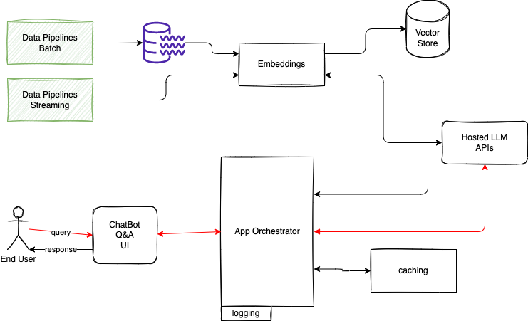
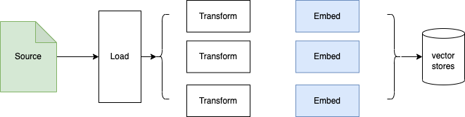
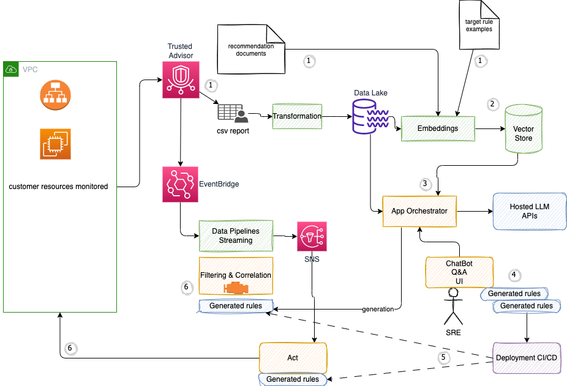
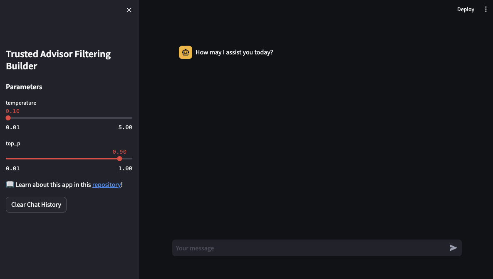

# A Reference Architecture for LLM solution in EDA world

A generic reference architecture for a LLM solution looks like in the following diagram:



1. **Data pipelines** are batch processing, which in the context of LLM may mix processing of unstructured documents with structured CSVs, Json, or SQL tables. data done in map-reduce platform to do Extract Transform Load job. Most of existing pipelines land their output to Data Lake. But modern pipeline may call directly a LLM to build embeddings to be saved into Vector Store. The flow will look like in the figure below, which is based on classical Retrieval augmented generation (RAG) process.

    

    RAG retrieves data from outside the language model (non-parametric) and augments the prompts by adding the relevant retrieved data in context.
1. **Streaming** is where connection to event-driven architecture land: a lot of business services / microservices are generating important events to be part of the future context of the end user interaction with the application. Those events can be aggregated, and a similar pipeline can be done with streaming application, consuming events, and doing the embedding via LLM calls then push to Vector Store.
1. **Embeddings** is the technique to create a numerical vector representation of each document chunks. There is open-source solution, like the [Sentence Transformers library from Hugging Face](https://huggingface.co/sentence-transformers), or can use proprietary, hosted LLM API.
1. **Vector Store**, persits vectors, a numerical representation of NL sentence, with indexing capability and similarity search function. Multiple solutions exist as Vector Store: [Faiss](https://faiss.ai/index.html), [ChromaDB](https://www.trychroma.com/), [AWS OpenSearch](https://docs.aws.amazon.com/opensearch-service/latest/developerguide/what-is.html)
1. **Hosted LLM** is a model serving service with LLM accessed via API. AWS Bedrock is used in all the code samples of this repository.
1. **Orchestrator** is the solution code, which connect all those component together, may use session caching in distributed, cloud based service, use Vector Store to do silimarity semantic search, and expose API to be used by a ChatBot user interface.

## Python env in docker

To avoid getting with your own python environment, specially with Mac computer, this repository includes a Dockerfile to build an python development environment with all the library. A virtual env will have done the same.

```sh
docker build -t jbcodeforce/python .
```

The `./startPythonDocker.sh` will mount the repository to the `/app` folder within the container. A exec inside the container will us test the code.

```sh
docker exec -ti pythonenv bash
```

If you encounter the following error while executing a python code accessing AWS bedrock via boto3, be sure to run the setup.sh script.

```sh
cd src
./setup.sh
# ...
Successfully installed PyYAML-6.0.1 awscli-1.29.21 boto3-1.28.21 botocore-1.31.21 colorama-0.4.4 docutils-0.16 jmespath-1.0.1 pyasn1-0.5.0 python-dateutil-2.8.2 rsa-4.7.2 s3transfer-0.6.2 six-1.16.0 urllib3-1.26.16
```

## RAG implementation

The RAG embedding process is illustrated in the [src/rag_pipeline/mkd-to-vector.py](./src/rag-pipeline/mkd-to-vector.py) LangChain code with local markdown files, or [aws-doc-to-vector.py](./src/rag-pipeline/aws-doc-to-vector.py) for web crawling.


## Orchestrator examples

It may be better to separate the orchestrator component from the user interface so we can test the model, the prompt, the chain or process logic of the LLM application.

The [qa-on-base-knowledge.py](./src/orchestrator/qa-on-base-knowledge.py) is the implementation of such orchestrator. It exposes method to be used by the user interface, like the chat bot in the user interface folder.

### Non regression testing

### Deployment


### Automated Pipeline? 

## A remove noise solution example

Some automated monitoring application can generate a lot of events, that could overflow a human, responsible for platform monitoring. This is not a new problem, and alarm filtering and correlation applications, based on inference engines, were used a lot at the end of 90s when network equipments where deployed worldwide. One of the challenge was to code the rules to remove false positive alarms, to limit the number of human work. Cloud providers are offering such capabilities of event generation based on a set of momnitoring, with filtering capability.
But one of the key problems is that the rules to define filtering, correlation and action to take, are custom to any customer. May LLM help?

As a concrete example, we can take AWS Trusted Advisor, which inspects an AWS environment and makes recommendations when opportunities exist to optimize cost, performance, availability, and security.

Those documented recommendations, in plain english, may serve to generate rules for an alarm and filtering inference engine. The problem generic rules will not be relevant for a given user. The rule parameters come from the knowledge of the user's environment.

As an illustrative example, take a recommendation about checking the age of the snapshot for Amazon EBS volumes, which can flag as red is the last snapshot is older than 30 days. Most of the time on dev or staging account those recommendations are becoming noise for the user, and then need to be filtered out. To do so user needs to specify the AWS account dedicated to development, or even within an account, considering specific resource not to monitor. Instead of coding those specific rules, we may be able to get them generated, or at least with specific prompt generate them.

The rule can be expressed in plain english like

```python
when the recommendation is part of Fault tolerance and includes ENS Snapshots type
    and the accountId is 000000001 or account name include one of [staging, dev] word, and the region is us-west-2
then
    filter out this recommendation
```

The above rules could be translated into lower code in a real time engine like Apache Flink, which use stateful processing with time window constraint. We will see below how it fits into the solution.

The following diagram illustrates the architecture we can develop to support a LLM based approach to this problem.




Using the reference architecture described above, we first need to define Trusted Advisor recommendation knowledge base or ground truth, so human can query the LLM with specific narrowed context about Truster Advisor recommendations. This done by doing a RAG, with embedding to a vector store.

A second data sources of will be the code example for temporal alarm and filtering rules, with an object model, or table definition that matches the structure of Trusted Advisor events. For example for the [EBS snapshots](https://docs.aws.amazon.com/AWSEC2/latest/UserGuide/ebs-creating-snapshot.html) recommendation:

```python
class ebs_snapshot():

    def __init__(self, account_Id, account_name, volume_id, volume_name, region, refreshed_time, snapshot_age, status, reason):
        self.account_Id = account_Id
        self.account_name = account_name
        self.volume_id = volume_id
        self.volume_name = volume_name
        self.region = region
        self.refreshed_time = refreshed_time
        self.snapshot_age = snapshot_age
        self.status = status
        self.reason = reason
```

The rule examples are template rules with place holder for account_id, account_name... as illustrated in previous example, and can be done in language like Apache Flink, SQL, Python, Spark streaming...

The last data source will be a weekly or monthly Trusted Advisor with all the environment specific information, that will be integrated into the vector store via the embedding process, and will be use to support the human's queries.

Now that the specific domain knowledge is coded, we can have the Q&A or chatbot user interface being used by the SRE end user to query LLM to generate dedicated rules.

The generate rules are specific to the user's environment, but still need to be fine tuned on a test simulation environment, to make them actionable and working for the target inference engine. Once the rulesets are clean they can be deployed to the target engines. We can define at least two types of ruleset, one for event filtering and correlation and one to automatically act on those events, for example to stop an EC2 instance running in dev after 5:00pm.

### Query

The human can ask the following type of queries:

* what are the accounts with dev or staging in their name?
* Giving my filtering engine is python function, for each staging or dev account generate the code to filtering trusted advisor avent for EBS snapshot recommendation
* Write a rule in python that if the account is dev, in the trusted advisor 
* Write a temporal rule for Apache Flink, applied with a 2 hour time window, to aggregate events on for a large number of EC2 security group recommendations, for the account 012345678 and report the aggregate. 

### RAG implementation

1. From a unique account Trusted Advisor report in excel format, running the tool, to build a md file about the recommendations. This is just a simple file processing, and should be done one time: `python extract-ta-recommendation.py`. The output is a file in the docs folder.
1. Be sure to have AWAWS_SESSION_TOKEN environment variable defined to be able to use `boto3` SDK and access Bedrock APIs 
1. Run embedding on the TA recommendations: `python mkd-to-vector.py`. The outcome is a embeddings folder with the vectors created with Chromadb, and Bedrock embedding. The alternate to Bedrock embeddings is to use [https://www.sbert.net/](https://www.sbert.net/), which is what is used in the current code. The vector store is saved on local disk so we can reuse it to do semantic similarity search.

### Orchestrator

This is the core of the application. It is integrated with Anthropic Claude 2 LLM deployed on AWS Bedrock amd uses Streamlit framework. The query has to be around Trusted Advisor body of knowledge. So before going to the llm we need to enrich the prompt with content from similarity search. 

The approach is to use a QA retriever. 

### User interface

The user interface is more a question and answer bot. To run it:

```sh
# under user-interface
python -m streamlit run ui-streamlit.py 
```



The current implementation is reusing the Orchestrator class and passes the query enterred by the user. In production the Orchestrator will be an independant service, scaling horizontally, as well as the User Interface.

THe query that may work:

* load balancers configured with a missing security group?

### Next

* Add template for code to be generated to filter event
* Tune the prompt to generate code
* Connect a Trusted Advisor to EventBridge
* Connect eventbridge to a streaming platform
* Deploy AWS Apache Flink with the code generated
