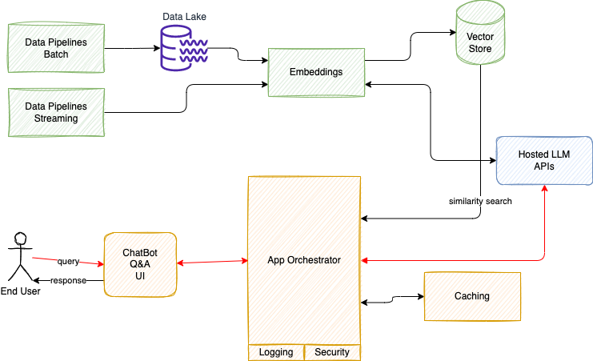

# A Reference Architecture for LLM solution in EDA world

A generic reference architecture for a LLM solution looks like in the following diagram:

1. **Data pipelines** are batch processing, which in the context of LLM may mix processing of unstructured documents with structured CSVs, Json, or SQL tables. data done in map-reduce platform to do Extract Transform Load job. Most of existing pipelines land their output to Data Lake. But modern pipeline may call directly a LLM to build embeddings to be saved into Vector Store. The flow will look like in the figure below, which is based on classical Retrieval augmented generation (RAG) process.

    

    RAG retrieves data from outside the language model (non-parametric) and augments the prompts by adding the relevant retrieved data in context.
1. **Streaming** is where connection to event-driven architecture land: a lot of business services / microservices are generating important events to be part of the future context of the end user interaction with the application. Those events can be aggregated, and a similar pipeline can be done with streaming application, consuming events, and doing the embedding via LLM calls then push to Vector Store.
1. **Embeddings** is the technique to create a numerical vector representation of each document chunks. There is open-source solution, like the [Sentence Transformers library from Hugging Face](https://huggingface.co/sentence-transformers), or can use proprietary, hosted LLM API.
1. **Vector Store**, persits vectors, a numerical representation of NL sentence, with indexing capability and similarity search function. Multiple solutions exist as Vector Store: [Faiss](https://faiss.ai/index.html), [ChromaDB](https://www.trychroma.com/), [AWS OpenSearch](https://docs.aws.amazon.com/opensearch-service/latest/developerguide/what-is.html)
1. **Hosted LLM** is a model serving service with LLM accessed via API. AWS Bedrock is used in all the code samples of this repository.
1. **Orchestrator** is the solution code, which connect all those component together, may use session caching in distributed, cloud based service, use Vector Store to do silimarity semantic search, and expose API to be used by a ChatBot user interface.

## RAG implementation

The RAG embedding process is illustrated in the [src/rag_pipeline/mkd-to-vector.py](./src/rag-pipeline/mkd-to-vector.py) LangChain code with local markdown files, or [aws-doc-to-vector.py](./src/rag-pipeline/aws-doc-to-vector.py) for web crawling.

## Orchestrator examples

 [qa-on-base-knowledge.py](./src/orchestrator/qa-on-base-knowledge.py) 