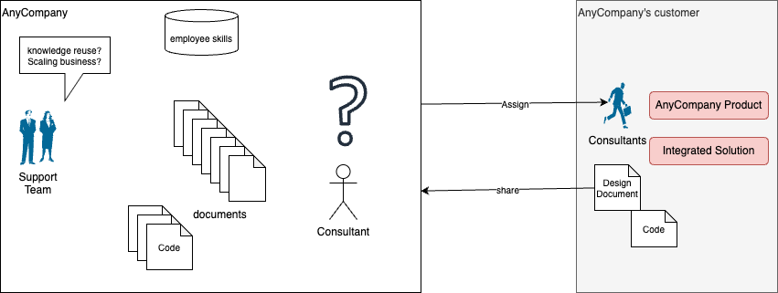
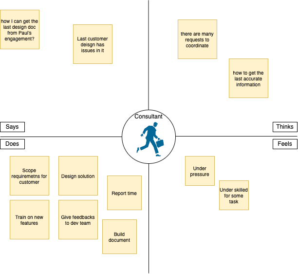
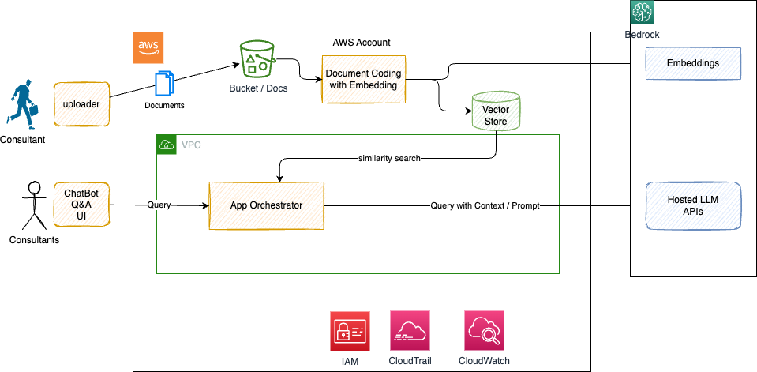
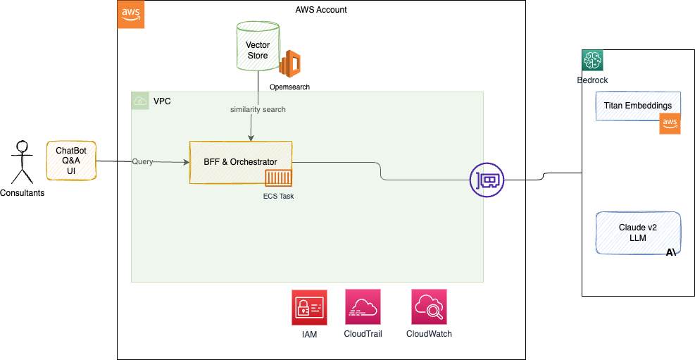

# Tech Sellers - Solution Architects tools

An application to demonstrate how to use specific documentation to do RAG on top of a Fundational Model like Amazon Titan, Anthropic Claude 2, or Jurasic.  The tech sellers and field solution architects can use to query the corpus.

## Requirements

The business context is illustrated in the following diagram. The fake company has professional staff delivering custom business solution around the company's core products. 



There are a lot artifacts built in this context. They generate 1 TB of doc per year. The information of "where is what" is tribal knowledge, and consultants need to meet other at the coffee break to get some answers or to share stories.

Executives from support team, wants to improve reusability of knowledge, scale their business so junior consultants can get more efficient than now. It takes 12 months to get a new hired consultant to be able to face a customer engagement alone. 24 months to be able to deliver consistent quality work. Consultants' problems the solution tries to address are highlighted in the following empathy map:




The high level solution after the first meeting with the project stakeholders



### User Story_1: build corpus

As a solution architect I want to upload a document or give a URL to crawl the content to build a new specific corpus so that I can query its content.

Which should be supported by:

* A crawler tool to load specific product documentation from a web site
* PDF to S3 using `aws s3 synch ...`
* Use OpenSearch or Kendra for vector stores
* Use Bedrock embeddings

This is supported by the [ragFunction]() component.

### User Story 2: Query custom corpus

As a solution architect I want to query the models to get answer using the corpus from the RAG.

## Implementation consideration

### Ingestion application

It uses Langchain pdf reader, and [RecursiveCharacterTextSplitter](https://api.python.langchain.com/en/latest/text_splitter/langchain.text_splitter.RecursiveCharacterTextSplitter.html) which by default has a chunk_size = 4000 and chunk_overlap= 200. Those parameters represent for `chunk_size` the Maximum size of chunks to return and for `chunk_overlap`, the overlap in characters between chunks.

## Demonstration:

### Pre-requisite

* [Create an AWS account](https://portal.aws.amazon.com/gp/aws/developer/registration/index.html) if you do not already have one and log in. The IAM user that you use must have sufficient permissions to make necessary AWS service calls and manage AWS resources.
* [AWS CLI](https://docs.aws.amazon.com/cli/latest/userguide/install-cliv2.html) installed and configured
* [Git Installed](https://git-scm.com/book/en/v2/Getting-Started-Installing-Git)
* In Bedrock enable Anthropic Claude model and Titan Embeddings

### Deployment

The target deployment for the two applications will be 



### Infrastructure as code

* Under IaC folder, create virtual environment for Python

    ```
    python3 -m venv .venv
    ```

    For a Windows platform, activate the virtualenv like this:

    ```
    .venv\Scripts\activate.bat
    ```

* Install the Python required dependencies: `pip install -r requirements.txt`

* Run the command below to bootstrap your account. CDK needs it to deploy

`cdk bootstrap`

* Review the CloudFormation template the cdk generates for you stack using the following AWS CDK CLI command:

`cdk synth`

* From the command line, use AWS CDK to deploy the AWS resources.

`cdk deploy --guided`

### Document ingestion feature

The source documents need to be ingested into Data lake (S3 bucket). As an example we will take a pdf document about a AWS Bedrock product documentation, upload to S3 bucket, which should trigger an event, processed by event bridge.

Event Bridge rule will call a ECS task to do the splitting of the document, embeddings the chunk to be persisted in a vector store.

#### To unit test the solution:

* Start to docker compose under `sa_tools` folder, to run a local opensearch database and a python environment.
* docker exec to pythonenv container. and install needed requirements: `pip install -r requirements.txt`
* Be sure to be connected to AWS
* Start the app.py, which takes a simple doc and runs the Bedrock embeddings, and save that in a opensearch collection named ``.

#### Build corpus while the app is deployed to AWS

1. Take a pdf from one of the AWS PDF. Claude was not trained on Bedrock so we can take its documentation: https://docs.aws.amazon.com/pdfs/bedrock/latest/userguide/bedrock-ug.pdf#what-is-bedrock in [data folder]()
1. Upload to S3


## User interface

* Run setup to get access to ECR and create a target repository.

* package with docker

```sh
docker build -t <accountID>.dkr.ecr.us-west-2.amazonaws.com/j9r_llm_demo .
docker push <accountID>.dkr.ecr.us-west-2.amazonaws.com/j9r_llm_demo 
```
